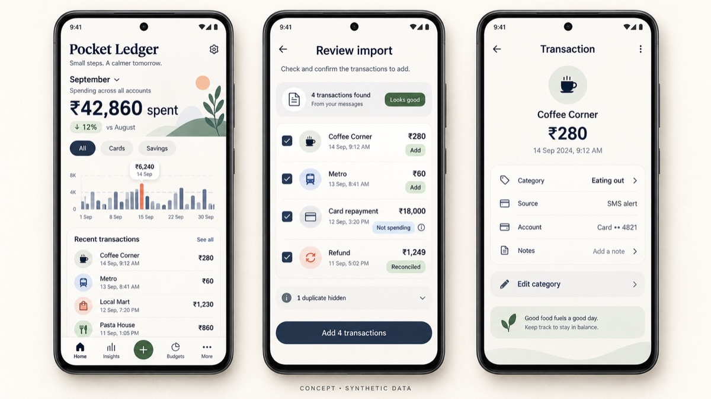

# Pocket Ledger

A privacy-first Android personal finance app that brings spending across credit cards and savings accounts into one clear ledger while keeping financial records and processing on the device. A private prototype is in progress; this repository is the public case study.

*Concept UI using entirely synthetic financial data. See [the visual product notes](./VISUAL_PRODUCT.md).*

## Why I am building it

Money leaves through several accounts, cards, refunds, transfers, and repayments, while the useful record is scattered across alerts and statements. Pocket Ledger is meant to answer a simple question without asking for another financial login: what did I actually spend, and through which account?

The difficult part is not drawing a chart. It is turning inconsistent transaction alerts into one trustworthy ledger without double-counting a card repayment, treating a transfer as spending, accepting a declined charge, or missing a refund.

## Product principles

- **Local by default.** Financial records are stored and processed on the Android device.
- **No account required.** No Pocket Ledger signup or app-owned cloud database.
- **Permission with a purpose.** A data source is requested only when the user chooses to import from it.
- **Explain the ledger.** Imported transactions should retain enough source context for a user to verify and correct them.
- **Corrections are first-class.** Manual entries and category corrections belong in the normal workflow.
- **Avoid false totals.** Declines, duplicates, refunds, owned-account transfers, and credit-card repayments must be handled explicitly.

## First-version scope

The list below is the intended first version, not a changelog of the private prototype. SMS import is in progress there; see [Current status](#current-status) for what v0.3.6 actually does.

1. Import transaction alerts from SMS with explicit user permission.
2. Recognize the bank, account type, masked account identifier, amount, direction, merchant, and timestamp when the message provides them.
3. Reject declined transactions and suppress duplicate alerts.
4. Reconcile refunds, transfers between owned accounts, and credit-card repayments so they do not distort spending.
5. Show a combined expense view with filters for an individual card or savings account.
6. Let the user add a transaction manually or correct its category.

Gmail and statement import are being evaluated, but they are not part of the confirmed first version.

## Privacy boundary

- No cloud AI processing, analytics, or automatic cloud backup.
- Real SMS messages, emails, statements, account identifiers, credentials, and signing keys never belong in a public repository.
- Development uses synthetic or redacted transaction fixtures.
- Any export must be user initiated; encrypted local storage and encrypted export are part of the design direction.

## Current status

A private Android prototype is in progress at v0.3.6 (navy ledger redesign). It is an on-device SMS ledger. The build runs on a personal device, and the in-app settings screen reports that version. It is not published on the Play Store, and there is no public APK.

On that device, v0.3.6 can:

- Import transactions from SMS, with permission, and re-check messages already imported
- Manage accounts
- Block screenshots
- Export a CSV by year, started by the user

The ledger stays on the device. Uninstalling the app deletes it. There is no backup yet. Encrypted local storage and encrypted export remain design direction, not a claim about this build. The prototype does not require a Pocket Ledger account, and it does not include cloud analytics or automatic cloud backup.

Parsing quality, reconciliation rules, and backup are still product work. They are not described here as finished.

## What this repository is

A public product case study, visual product direction, and planned system architecture. See `VISUAL_PRODUCT.md` and `ARCHITECTURE.md`.

The application source, financial parsing rules, bank-specific templates, test corpus, and all personal financial data stay private. No application code is published here.

## Who is building it

Yashasvi Shailly. Product, design, and engineering.
