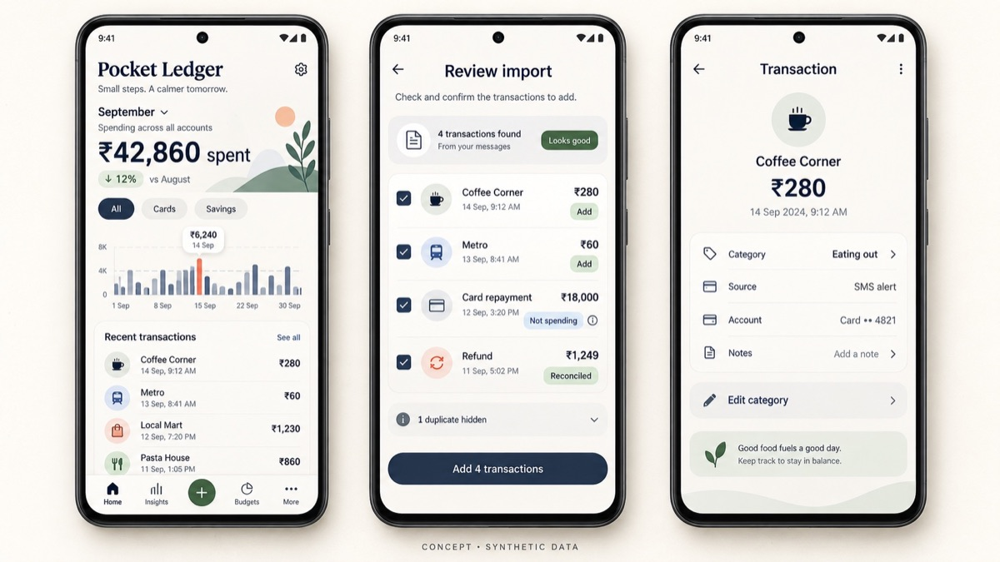

# Pocket Ledger, visual product direction

> **Status:** concept. Pocket Ledger is still in product and architecture planning. These are illustrative product mockups, not screenshots of a shipped build. Every transaction, account, identifier, and amount shown is synthetic.

## The visual job

A finance app earns trust by making the total understandable. Pocket Ledger should feel calm and precise, but never so minimal that it hides how a transaction was classified.

The visual system is designed around three questions:

1. What did I actually spend?
2. Which account did it move through?
3. Why did Pocket Ledger count—or not count—this record?

## The three concept screens

### Combined ledger

The first screen leads with the monthly spending total, then keeps account filters, trend context, and recent transactions close enough to audit the number. Cards and savings accounts are views over the same ledger, not separate products.

### Import review

Import is a review step, not an invisible background event. Ordinary purchases can be accepted quickly, while a repayment, refund, duplicate, or ambiguous alert shows its treatment before it changes a total.

### Transaction evidence

A transaction keeps its category, source, and masked account visible. The user can correct the category without losing the evidence that produced the original record.

## Visual language

- Warm ivory rather than clinical white
- Ink navy for totals and primary actions
- Sage for reconciled or trusted states
- Muted indigo for selected filters and structure
- Coral used sparingly for exceptions or attention
- Rounded surfaces with clear edges, not translucent glass
- Editorial headings paired with compact, legible utility text

## Trust rules

- Never use colour as the only explanation.
- Always pair an exception with plain language such as “Not spending” or “Reconciled.”
- Show masked account identifiers wherever account context matters.
- Keep manual correction visible and reversible.
- Avoid celebratory language that moralizes spending.
- Never imply that a concept screen is a shipped feature.

## Important states still to design

- An alert the parser cannot understand
- A possible duplicate that needs confirmation
- A partial refund
- A transfer between two owned accounts
- A card repayment that does not match a statement balance
- A manual entry with no imported source
- An empty first month
- Permission denied or later revoked

## Public boundary

The public visuals use fictional merchants, masked identifiers, and synthetic amounts. Real alerts, statements, balances, account names, financial history, parsing templates, and application code remain private.
